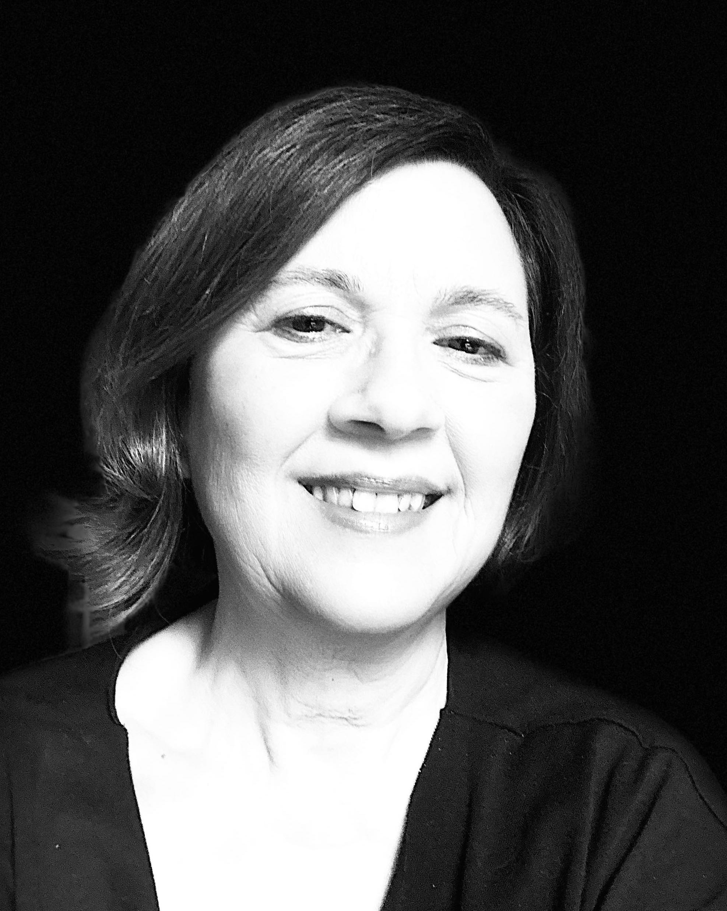

# Simona Marchesini

Historical Linguist | Founder and Scientific Director of Alteritas

Verona, Italy

---

## About

I am a historical linguist specialised in the fragmentary languages of pre-Roman Italy, ancient writing systems, epigraphy, cultural interaction and historical anthropology.

I am Founder and Scientific Director of Alteritas – Interaction among Peoples (Verona, Italy). My research combines historical linguistics, archaeology, anthropology, religion, onomastics and digital humanities, with particular attention to the reconstruction of meaning in fragmentary texts and cultural contexts.

My current work focuses on the relationship between language, writing, cognition and society, as well as on the development of the Integrated Theory of Context (ITC).

---

## Current Research

- Integrated Theory of Context (ITC)
- Fragmentary Languages of Ancient Italy
- Etruscan, Messapic and Raetic Studies
- Ancient Writing Systems
- Epigraphy and Literacy
- Religion and Ritual Communication
- Cultural Interaction and Mobility
- Historical Linguistics
- Digital Humanities

---

## Recent Projects

### CORRIGE (2024–2027)

Erasmus+ project on writing errors, literacy and educational assessment.

Role: Scientific Coordinator (Alteritas)

Project website: [CORRIGE](https://corrige.ipb.pt/ui/en/#././public/start)

---

### xFORMAL (2021–2025)

MSCA RISE project on informal and non-formal e-learning for cultural heritage.

Role: Scientific Coordinator

Project website: [xFORMAL](https://xformal.eu)

---

### SELECT (2020–2023)

Research project on ancient languages, epigraphy and cultural heritage.

Role: Scientific Coordinator

Project website: [SELECT](https://selecteplus.eu)

---

### AELAW (2015–2018)

COST Action IS1407 Ancient European Languages and Writings.

Role: Vice-Chair

Project website: [AELAW](https://aelaw.unizar.es)

---

## Research Leadership

- Founder and Scientific Director, Alteritas
- Vice-Chair, COST Action AELAW (2015–2018)
- Scientific Coordinator of European research projects
- Coordinator of international networks in historical linguistics, epigraphy and cultural heritage

---

## Selected Publications

A complete list of publications is available in my CV.

---

## Curriculum Vitae

A complete academic CV is available here:

📄 [Download CV (PDF)](Simona_Marchesini_cv.pdf)

## Profiles

- [ORCID](https://orcid.org/0000-0003-1384-2912)
- [Google Scholar](https://scholar.google.com/citations?hl=it&user=rr1GGmwAAAAJ)
- [Academia.edu](https://independent.academia.edu/SimonaMarchesini)
- [RESEARCH GATE] (https://www.researchgate.net/profile/Simona-Marchesini?ev=hdr_xprf)

---

## Contact

**Simona Marchesini**

Founder and Scientific Director  
Alteritas – Interaction among Peoples

Verona, Italy
